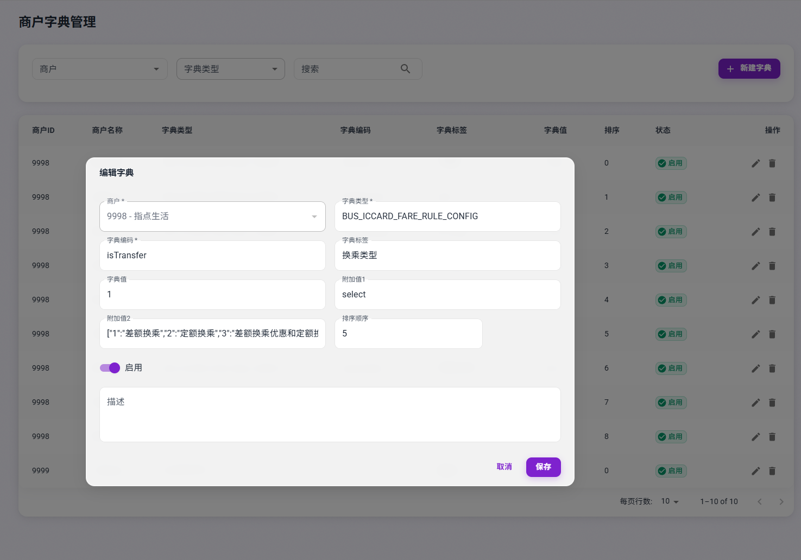

## 需求说明
珠海通项目要求能在通讯平台编辑票价参数文件，并能将其发布到通讯平台下发给终端

## 票价参数文件格式
票价参数文件采用JSON格式，包含以下字段：

lineVer   				:  文件版本号 
lineName					:		线路名称
lineNumber				： 主线路4位
fare							： 票价，单位分
groupNumber				： 子线路号（组号2位）
diffTransferTime	： 差额换乘时间，单位分
fixedTransferTime	: 定额换乘时间 单位 分
transferType			： 车辆是否支持换乘 1支持 0 不支持
interGroupTransferRules： 组间换乘组规则， 例如 0102 为 先在01组乘车再到02组乘车，支持换乘。
cardType					： 卡类型
cardDiscount			：折扣 ,例如90 为9折
voiceMessage			：播报语言参数 
display						：显示内容
isSwiping					连刷间隔，单位秒
isExpiryDate			：是否判断有效期， 1判断有效期， 0不判断有效期
isTransfer	0			：该卡不允许换乘优惠，  1：该卡只允许差额换乘优惠，  2: 该卡只允许定额换乘优惠，  3：该卡允许差额换乘优惠和定额换乘优惠。
QRFactoryNum   二维码的发码渠道
customBuff           二维码的自定义数据


## 生成的票价文件示例：
```json
{
    "type": "PZB",
    "para": "100101",
    "name": "线路票价文件",
    "version": "0001",
    "datetime": "2023-10-01 12:00:00",
    "content": {
        "lineNumber": "1001",
        "lineName": "Zhuhai Express",
        "fare": "200",
        "groupNumber": "03",
        "diffTransferTime": "90",
        "fixedTransferTime": "60",
        "transferType": "1",
        "interGroupTransferRules": ["0102","0201","0901","0103","0301","0203","0302","0901","0902","0903","0904"],
        "cardDiscountInformation": [
            {
                "cardType": "00",
                "cardDiscount": "90",
                "voiceMessage": "sound903",
                "display": "普通卡",
                "isSwiping": "1",
                "isExpiryDate": "0",
                "isTransfer": "3"
            },
            {
                "cardType": "01",
                "cardDiscount": "0",
                "voiceMessage": "普通老人卡",
                "display": "普通老人卡",
                "isSwiping": "0",
                "isExpiryDate": "1",
                "isTransfer": "0"
            },
            {
                "cardType": "80",
                "cardDiscount": "100",
                "voiceMessage": "珠海通乘车码",
                "display": "珠海通乘车码",
                "isSwiping": "0",
                "isExpiryDate": "1",
                "isTransfer": "0",
                "QRFactoryNum": "10000011",
                "customBuff": "0101008000"
            },
            {
                "cardType": "81",
                "cardDiscount": "100",
                "voiceMessage": "滴滴码",
                "display": "滴滴码",
                "isSwiping": "0",
                "isExpiryDate": "1",
                "isTransfer": "0",
                "QRFactoryNum": "10000014",
                "customBuff": "0101008000"
            },
        ]
    }
}
```

## 界面逻辑说明

线路票价文件管理主要用于编辑和发布票价参数文件。用户可以通过该界面对各线路的基础参数、票价参数进行编辑，对于每个线路票价参数信息，需要有线路号，子线路号（组号），线路名称，票价等基础信息，还包含diffTransferTime（差额换乘时间）、fixedTransferTime（定额换乘时间）、transferType（是否支持换乘）等额外参数，这些额外参数可通过字典类型（BUS_LINE_EXTRA_PARAM​​）动态获取，除此之后，还包含各卡类的票价参数信息cardDiscountInformation，包含卡类型、折扣、语音播报、显示内容、是否支持连刷、是否判断有效期、是否支持换乘优惠等参数，这些卡类参数可通过字典类型（BUS_ICCARD_FARE_RULE_CONFIG）动态获取。

字典配置说明
在字典中配置字典类型 BUS_ICCARD_FARE_RULE_CONFIG，添加多个字典值，如卡类、折扣、语音等，并针对每个字典值配置对应的控件类型和附加值。字典值的名称和控件类型将用于生成票价参数文件中的相应字段。


目前考虑到参数可能需要使用到下面这些类型的控件：
| 控件类型	| 附加值1值	| 附加值2示例	| 适用场景 |
| --- | --- | --- | --- |
text    | text	| { "maxLength": 50, "placeholder": "请输入", "trim": true }	| 文本输入 |
number	| number	| { "min": 0, "max": 100, "step": 1, "unit": "元" }	| 数字输入 |
select	| select	| { "options": [ {"value": "1", "label": "启用"}, {"value": "0", "label": "禁用"} ], "default": "1" }	| 下拉选择 |
switch	| switch	| { "valueType": "number", "onValue": 1, "offValue": 0, "activeText": "启用", "inactiveText": "禁用" }	| 开关控件 |
tag-input    | tag	| { "validation": { "pattern": "^\\d{4}$", "maxCount": 10 }, "separator": ",", "placeholder": "输入后按回车" }	| 标签输入 |
checkbox	| checkbox	| { "options": [ {"value": "1", "label": "选项A"}, {"value": "2", "label": "选项B"} ], "default": ["1"] }	| 多选框 |
radio	| radio	| { "options": [ {"value": "1", "label": "是"}, {"value": "0", "label": "否"} ], "default": "1" }	| 单选框组 |
date	| date	| { "format": "YYYY-MM-DD", "disabledDate": "beforeToday" }	| 日期选择器 |
time	| time	| { "format": "HH:mm", "minTime": "08:00", "maxTime": "18:00" }	| 时间选择器 |
slider	| slider	| { "min": 0, "max": 100, "step": 5, "marks": { "0": "低", "50": "中", "100": "高" } }	| 滑块 |
| --- | --- | --- | --- |


对于字典表，针对这些参数字段，我会在字典值中放默认值，在附加值1中放控件类型，在附加值2中放对应的控件属性和验证等信息。


### 1 线路票价信息管理界面说明
主页面展示线路基本信息：商户名称、线路名称、线路编号，子线路号（组号），票价，版本，状态。状态是指当前版本是否生成，分为草稿和已提交两种状态，草稿状态下用户可以对线路信息进行编辑，已提交状态下用户无法编辑，但可以在此基础上创建新版本，新版本的状态默认为草稿。版本号是4位16进制数，从0001开始，每次创建新版本时，版本号加1。每次线路版本提交后，都需要保存历史版本信息，可以通过查询历史版本来查看之前的版本信息。


线路票价文件的编辑页面：
- 需要展示线路基本信息，动态展示线路额外参数，额外参数需要的字段从字典中获取，根据字典的配置信息，自动生成相应的控件。
- 需要展示各卡类的票价参数信息，这是一组卡类信息，每个卡类都包含多个卡类相关的参数，用户可以对已添加的每个卡类信息进行编辑和删除，也可以新增一个卡类信息，具体的卡类参数字段从字典BUS_ICCARD_FARE_RULE_CONFIG中获取，根据字典信息动态生成相应的控件，其中每个参数都默认被勾选，用户可以取消勾选，取消勾选后，该参数不用根据配置的校验信息验证输入内容，也不参与生成票价参数文件（也就是可以不被保存）。
- 线路文件content中的内容是一个JSON对象，包含线路基本信息、线路额外参数、卡类参数信息等。其中线路基本信息是固定字段，卡类参数信息也是固定字段，但卡类参数信息中的每个参数都是动态生成的，具体的参数字段从字典中获取，根据字典的配置信息，自动生成相应的控件。用户可以对已添加的每个卡类信息进行编辑和删除，也可以新增一个卡类信息。

线路票价文件，要能预览最终生成的JSON文件，预览的JSON文件需要根据用户输入的内容动态生成，预览按钮点击后，弹出一个对话框，展示最终生成的JSON文件，用户可以复制该JSON文件。预览的JSON文件中需要包含线路基本信息、线路额外参数、卡类参数信息等。见上面票价文件示例。其中 type": "PZB" 对票价文件来说是固定值 ，"para": "100101",  是取线路号+子线路号组成，


### 你的需求
- 需要创建线路票价信息表，包含线路基本信息、线路额外参数、卡类参数信息等字段。线路额外参数信息可以是一个json对象，包含线路额外参数的字段和对应的值。卡类参数信息可以是一个json对象，包含卡类参数的字段和对应的值。包含版本号，版本状态，版本创建时间等字段。版本号是4位16进制数，从0001开始，每次创建新版本时，版本号加1。每次线路版本提交后，都需要保存历史版本信息，可以通过查询历史版本来查看之前的版本信息。
- 实现线路票价信息的编辑和提交功能，用户可以在编辑页面对线路基本信息、线路额外参数、卡类参数信息进行编辑和保存。编辑好的线路票价信息可以预览最终生成的JSON文件，预览的JSON文件需要根据用户输入的内容动态生成，预览按钮点击后，弹出一个对话框，展示最终生成的JSON文件，用户可以复制该JSON文件。预览的JSON文件中需要包含线路基本信息、线路额外参数、卡类参数信息等。可以提交，提交后，版本状态变为已提交，用户无法编辑，但可以在此基础上创建新版本，新版本的状态默认为草稿,同时保存历史版本信息，同时提交功能会将生成的文件内容发布到文件版本管理中。
- 实现线路票价信息的查询功能，用户可以通过查询条件查询线路票价文件的基本信息、线路额外参数、卡类参数信息等字段。用户可以通过查询条件查询历史版本的基本信息、线路额外参数、卡类参数信息等字段。
- 实现根据字典配置动态生成相应的控件，这些控件应该实现为一个组件，支持动态渲染和验证。控件的类型和属性可以通过字典配置来获取，控件的值可以通过双向绑定来获取。控件的值需要在提交时进行验证，如果验证不通过，则提示用户输入错误信息。
- 