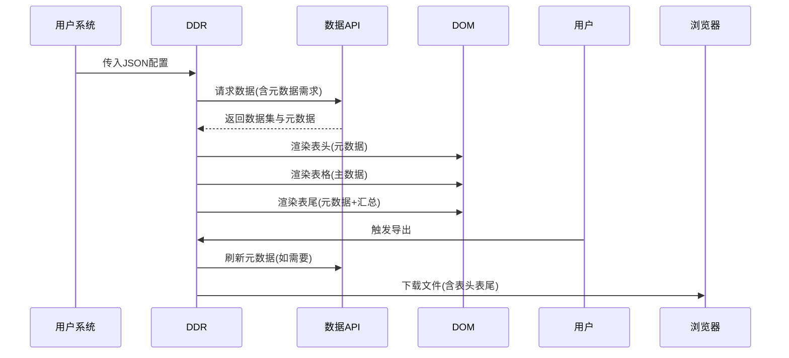
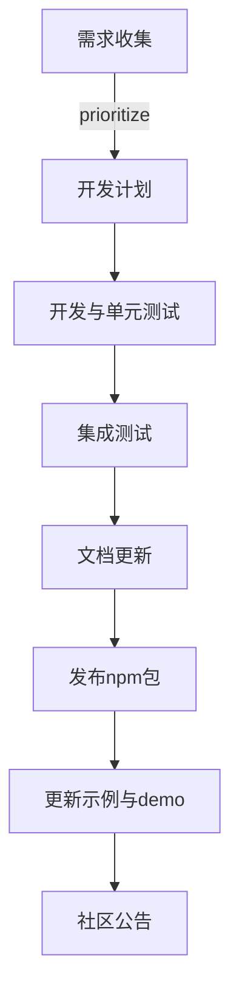

以下是针对您需求的完整整理，涵盖核心目标、技术方案、实施步骤及扩展建议：

---

### **一、需求核心目标**
1. **核心功能**
   - 纯数据驱动的报表展示（无交互逻辑）
   - 支持Excel/PDF导出、打印
   - 动态配置表头、合并单元格、样式等
2. **易集成性**
   - 通过JSON配置快速接入新报表
   - 与现有项目解耦，零业务逻辑侵入
3. **性能要求**
   - 支持10万+数据量的流畅渲染

---

### **二、技术方案摘要**
#### **1. 组件名称**
**Data-Driven Report (DDR)**
- 名称无冲突，明确数据驱动特性

#### **2. 架构设计**
```markdown
├── core/                  # 无依赖核心
│   ├── render-engine      # DOM/Canvas双模式渲染
│   ├── exporter           # 导出模块（Excel/PDF）
├── config-loader/         # 配置加载器
│   ├── local-json.js      # 本地文件加载
│   └── remote-api.js      # 动态配置接口
└── adapters/              # 框架封装（可选）
    ├── react.js
    └── vue.js
```

#### **3. 核心流程**


---

### **三、详细实现方案**
#### **1. 配置规范（JSON）**
```json
// 示例：销售报表配置 sales.json
{
  "meta": {
    "name": "销售日报",
    "version": "1.0"
  },
  "dataSource": {
    "api": "/api/sales",
    "method": "GET",
    "params": { "type": "daily" } // 固定参数
  },
  "columns": [
    {
      "key": "region",
      "title": "地区",
      "width": 120,
      "merge": "vertical" // 相同值合并
    },
    {
      "key": "amount",
      "title": "销售额",
      "formatter": "currency" // 内置格式化
    }
  ],
  "features": {
    "exportExcel": true,
    "watermark": "机密"
  }
}
```

#### **1.1. 后端API数据结构**

后端API在提供报表数据时，既需要返回主要的表格数据，也需要提供表头表尾所需的元数据。以下是建议的API响应结构：

```json
// API响应示例 - GET /api/reports/sales
{
  "success": true,
  "code": 200,
  "data": {
    // 表格主数据
    "records": [
      { "region": "华东", "product": "产品A", "amount": 12500 },
      { "region": "华东", "product": "产品B", "amount": 8200 },
      { "region": "华南", "product": "产品A", "amount": 9800 }
      // 更多数据行...
    ],

    // 分页信息（可选）
    "pagination": {
      "pageSize": 20,
      "pageNumber": 1,
      "total": 136,
      "totalPages": 7
    },
      // 元数据（不预设用途，由前端决定显示位置）
    "metadata": {
      // 报表基本信息
      "report": {
        "title": "销售业绩报表",
        "code": "SR-20250523",
        "generateTime": "2025-05-23 15:30:45",
        "dataSource": "销售管理系统"
      },

      // 企业/组织信息
      "company": {
        "name": "科技创新有限公司",
        "logo": "https://example.com/logo.png",
        "department": "销售部"
      },

      // 时间范围信息
      "period": {
        "start": "2025-05-01",
        "end": "2025-05-23",
        "type": "monthly",
        "description": "2025年5月"
      },

      // 单位和格式设置
      "units": {
        "currency": "CNY",
        "currencySymbol": "¥",
        "numberFormat": "#,##0.00"
      },

      // 相关人员信息
      "personnel": {
        "creator": {
          "id": "1001",
          "name": "张三",
          "position": "销售经理",
          "timestamp": "2025-05-23 14:20:30"
        },
        "reviewer": {
          "id": "2002",
          "name": "李四",
          "position": "销售总监",
          "timestamp": "2025-05-23 15:05:12",
          "status": "approved"
        },
        "approver": {
          "id": "3003",
          "name": "王五",
          "position": "副总经理",
          "timestamp": null,
          "status": "pending"
        }
      },

      // 汇总数据（用于表尾汇总行或表头概览）
      "summary": {
        "totalAmount": 152600,
        "avgAmount": 10173.33,
        "maxAmount": 12500,
        "minAmount": 8200,
        "count": 15,
        "customMetrics": {
          "targetAchievementRate": "87.2%",
          "yearOverYearGrowth": "12.5%"
        }
      },

      // 其他自定义元数据
      "custom": {
        "remark": "本季度销售同比增长15%",
        "tags": ["重要", "季度报表"],
        "attachments": [
          { "name": "销售明细", "url": "/reports/sales/details" }
        ]
      }
    }
  }
}
```

**处理元数据的关键代码**：

```javascript
class DDR {
  // ...existing code...

  async _fetchData(dataSourceConfig) {
    const response = await fetch(dataSourceConfig.api, {
      method: dataSourceConfig.method || 'GET',
      headers: dataSourceConfig.headers || { 'Content-Type': 'application/json' },
      body: dataSourceConfig.method === 'POST' ? JSON.stringify(dataSourceConfig.params) : undefined
    });

    const result = await response.json();

    if (!result.success) {
      throw new Error(`API错误: ${result.message || '未知错误'}`);
    }

    // 提取主数据、元数据和汇总信息
    return {
      records: result.data.records || [],
      metadata: result.data.metadata || {},
      pagination: result.data.pagination,
      summary: result.data.metadata?.summary || {}
    };
  }
    // 从元数据中根据路径获取值
  _getValueByPath(obj, path) {
    if (!path) return undefined;
    return path.split('.').reduce((acc, part) =>
      acc && acc[part] !== undefined ? acc[part] : undefined, obj);
  }

  _render(container, config, apiResponse) {
    const { records, metadata, pagination } = apiResponse;

    // 1. 渲染表头(如果配置了)
    if (config.header) {
      // 准备表头需要的元数据，从统一的metadata中提取
      const headerData = {};

      // 处理表头标题
      if (config.header.title && typeof config.header.title === 'object' && config.header.title.metadataPath) {
        headerData.title = this._getValueByPath(metadata, config.header.title.metadataPath);
      }

      // 处理Logo
      if (config.header.logo && config.header.logo.metadataKey) {
        headerData.logoUrl = this._getValueByPath(metadata, config.header.logo.metadataKey);
      }

      // 处理表头字段
      if (config.header.fields && config.header.fields.length) {
        headerData.fields = {};
        config.header.fields.forEach(field => {
          if (field.metadataPath) {
            headerData.fields[field.key] = this._getValueByPath(metadata, field.metadataPath);
            // 应用格式化函数(如果有)
            if (field.formatter && typeof this.formatters[field.formatter] === 'function') {
              headerData.fields[field.key] = this.formatters[field.formatter](
                headerData.fields[field.key], metadata
              );
            }
          }
        });
      }

      ReportHeaderFooter.renderHeader(container, config.header, headerData);
    }

    // 2. 渲染主数据表格
    this._renderTable(container, config, records);

    // 3. 渲染表尾(如果配置了)
    if (config.footer) {
      // 准备表尾需要的元数据，从统一的metadata中提取
      const footerData = {
        fields: {},
        signatures: {},
        summary: {}
      };

      // 处理表尾字段
      if (config.footer.fields && config.footer.fields.length) {
        config.footer.fields.forEach(field => {
          if (field.metadataPath) {
            footerData.fields[field.key] = this._getValueByPath(metadata, field.metadataPath);
          }
        });
      }

      // 处理签名区域
      if (config.footer.signatures && config.footer.signatures.length) {
        config.footer.signatures.forEach((sig, index) => {
          const signatureData = {};
          if (sig.metadataPath) {
            signatureData.name = this._getValueByPath(metadata, sig.metadataPath);
          }
          if (sig.dateMetadataPath) {
            signatureData.date = this._getValueByPath(metadata, sig.dateMetadataPath);
          }
          footerData.signatures[index] = signatureData;
        });
      }

      // 处理汇总数据(可以使用API返回的预计算汇总或前端计算)
      if (config.footer.summary && config.footer.summary.length) {
        config.footer.summary.forEach(sum => {
          if (sum.metadataPath) {
            footerData.summary[sum.column] = this._getValueByPath(metadata, sum.metadataPath);
          } else {
            // 如果没有指定元数据路径，则进行前端计算
            footerData.summary[sum.column] = this._calculateSummary(records, sum);
          }
        });
      }

      // 分页信息
      if (pagination) {
        footerData.pagination = pagination;
      }

      ReportHeaderFooter.renderFooter(container, config.footer, footerData);
    }
  }
}
```

**多个数据源场景**:

某些复杂报表可能需要从多个API获取数据，可通过以下方式配置：

```json
{
  "dataSource": {
    // 主数据API
    "api": "/api/reports/sales",
    // 独立的元数据API(可选)
    "metadataSource": {
      "api": "/api/reports/metadata/sales",
      "method": "POST",
      "params": {
        "reportId": "sales-2025-Q2"
      }
    }
  }
}
```

**元数据刷新策略**:

```javascript
// 元数据可能需要独立于主数据刷新(如审批状态更新)
report.refreshMetadata(); // 仅刷新元数据
report.reload(); // 刷新所有数据
```

#### **2. 关键实现代码**
**数据加载与渲染**
```javascript
class DDR {
  async init(container, configPath) {
    const config = await this._loadConfig(configPath);
    const data = await this._fetchData(config.dataSource);
    this._render(container, config, data);
  }

  _loadConfig(path) {
    // 支持本地JSON或远程API
    return path.startsWith('http') ?
      fetch(path).then(r => r.json()) :
      import(`./configs/${path}.json`);
  }
}
```

#### **2.1. 元数据处理最佳实践**

在设计报表系统的元数据处理时，建议遵循以下最佳实践：

**1. 元数据分层管理**

```javascript
// 元数据层次结构
const metadata = {
  // 全局元数据(所有报表共享)
  global: {
    companyName: "科技创新有限公司",
    companyLogo: "url-to-logo",
    currentUser: { name: "张三", role: "manager" }
  },

  // 报表类型元数据(同一类报表共享)
  reportType: {
    type: "finance",
    approvalWorkflow: "三级审批",
    dataSource: "财务系统"
  },

  // 实例元数据(针对特定报表实例)
  instance: {
    reportId: "FIN-2025-05-Q2",
    generatedTime: "2025-05-23 15:30:45",
    period: "2025年第二季度"
  }
};
```

**2. API结构与状态码规范**

```javascript
// 标准API响应结构
{
  "success": true,          // 请求是否成功
  "code": 200,              // 状态码
  "message": "",            // 错误信息(如有)
  "data": {/* 数据结构 */},  // 数据内容
  "timestamp": 1621234567890 // 服务器时间戳
}

// 常见状态码定义
const API_CODES = {
  SUCCESS: 200,
  INVALID_PARAMS: 400,
  UNAUTHORIZED: 401,
  FORBIDDEN: 403,
  NOT_FOUND: 404,
  SERVER_ERROR: 500,
  // 业务状态码(自定义)
  DATA_NOT_READY: 10001,    // 报表数据未准备好
  APPROVAL_REQUIRED: 10002, // 需要审批
  EXPORT_IN_PROGRESS: 10003 // 导出任务正在处理
};
```

**3. 元数据缓存与刷新策略**

```javascript
class MetadataManager {
  constructor() {
    this.cache = new Map();
    this.expiryTimes = new Map();
  }

  async getMetadata(reportId, forceRefresh = false) {
    const now = Date.now();
    const cacheKey = `report_${reportId}`;

    // 检查缓存是否有效
    if (!forceRefresh &&
        this.cache.has(cacheKey) &&
        this.expiryTimes.get(cacheKey) > now) {
      return this.cache.get(cacheKey);
    }

    // 获取新数据
    const metadata = await this.fetchMetadataFromAPI(reportId);

    // 更新缓存
    this.cache.set(cacheKey, metadata);

    // 设置过期时间(例如30分钟)
    this.expiryTimes.set(cacheKey, now + 30 * 60 * 1000);

    return metadata;
  }

  // 针对特定场景的差异化缓存策略
  getCacheConfig(reportType) {
    const cacheConfigs = {
      'financial': { ttl: 30 * 60 * 1000, forceRefreshOnExport: true },
      'operational': { ttl: 5 * 60 * 1000, forceRefreshOnExport: false },
      'realtime': { ttl: 60 * 1000, forceRefreshOnExport: true }
    };

    return cacheConfigs[reportType] || { ttl: 15 * 60 * 1000, forceRefreshOnExport: true };
  }
}
```

**4. 审批状态实时更新**

```javascript
class ApprovalStatusMonitor {
  constructor(reportId, callback) {
    this.reportId = reportId;
    this.callback = callback;
    this.interval = null;
    this.lastStatus = null;
  }

  start() {
    // 定期检查审批状态
    this.interval = setInterval(async () => {
      const status = await this.fetchApprovalStatus();

      // 状态有变化时触发回调
      if (status !== this.lastStatus) {
        this.lastStatus = status;
        this.callback(status);
      }
    }, 30000); // 每30秒检查一次
  }

  stop() {
    if (this.interval) {
      clearInterval(this.interval);
      this.interval = null;
    }
  }

  async fetchApprovalStatus() {
    const response = await fetch(`/api/reports/${this.reportId}/approval-status`);
    const data = await response.json();
    return data.status; // pending, approved, rejected
  }
}

// 使用示例
const monitor = new ApprovalStatusMonitor('FIN-2025-Q2', (status) => {
  // 更新表尾中的审批状态
  report.updateFooterMetadata({
    approver: {
      status: status,
      timestamp: new Date().toISOString()
    }
  });
});

monitor.start();
```

**5. 元数据本地化与国际化**

```javascript
// 本地化处理元数据
function localizeMetadata(metadata, locale = 'zh-CN') {
  const formatters = {
    'zh-CN': {
      date: (val) => new Date(val).toLocaleDateString('zh-CN', { year: 'numeric', month: 'long', day: 'numeric' }),
      currency: (val) => `¥${val.toLocaleString('zh-CN')}`,
      percent: (val) => `${(val * 100).toFixed(2)}%`
    },
    'en-US': {
      date: (val) => new Date(val).toLocaleDateString('en-US'),
      currency: (val) => `$${val.toLocaleString('en-US')}`,
      percent: (val) => `${(val * 100).toFixed(2)}%`
    }
  };

  // 深拷贝以避免修改原始数据
  const result = JSON.parse(JSON.stringify(metadata));

  // 处理日期
  if (result.header?.periodStart) {
    result.header.formattedPeriod = `${formatters[locale].date(result.header.periodStart)} - ${formatters[locale].date(result.header.periodEnd)}`;
  }

  // 处理金额
  if (result.summary?.totalAmount) {
    result.summary.formattedAmount = formatters[locale].currency(result.summary.totalAmount);
  }

  return result;
}
```

**数据导出模块**
```javascript
class Exporter {
  static excel(data, fileName) {
    const ws = XLSX.utils.json_to_sheet(data);
    const wb = XLSX.utils.book_new();
    XLSX.utils.book_append_sheet(wb, ws, "Sheet1");
    XLSX.writeFile(wb, `${fileName}.xlsx`);
  }
}
```

#### **3. PDF导出核心实现**

**精确分页算法**：
```javascript
class PDFExporter {
  // 精确计算分页点
  calculatePageBreaks(data, config) {
    const { headerHeight, footerHeight, dataRowHeight } = this.measureHeights();
    const pageHeight = 297; // A4高度(mm)
    const margins = { top: 15, bottom: 15 };

    // 计算各页可用空间
    const firstPageDataHeight = pageHeight - margins.top - margins.bottom - headerHeight - 25; // 页码预留
    const middlePageDataHeight = pageHeight - margins.top - margins.bottom - 18; // 页码预留
    const lastPageDataHeight = pageHeight - margins.top - margins.bottom - footerHeight - 20; // 页码预留

    // 精确计算每页行数
    const firstPageMaxRows = Math.floor(firstPageDataHeight / dataRowHeight);
    const middlePageMaxRows = Math.floor(middlePageDataHeight / dataRowHeight);

    return this.generatePageBreaks(data.length, firstPageMaxRows, middlePageMaxRows);
  }

  // Canvas精确裁剪
  cropCanvasForPage(canvas, pageIndex, pageBreaks) {
    const { headerHeightRatio, footerHeightRatio } = this.calculateHeightRatios();
    const dataAreaRatio = 1 - headerHeightRatio - footerHeightRatio;

    if (pageIndex === 0) {
      // 第一页：表头 + 数据
      const endRowRatio = pageBreaks[0].endRow / this.totalDataRows;
      const endPercent = headerHeightRatio + (endRowRatio * dataAreaRatio);
      return this.cropCanvas(canvas, 0, endPercent);
    } else {
      // 后续页：纯数据
      const startRowRatio = pageBreaks[pageIndex - 1].endRow / this.totalDataRows;
      const endRowRatio = pageBreaks[pageIndex]?.endRow / this.totalDataRows || 1;
      const startPercent = headerHeightRatio + (startRowRatio * dataAreaRatio);
      const endPercent = headerHeightRatio + (endRowRatio * dataAreaRatio);
      return this.cropCanvas(canvas, startPercent, endPercent);
    }
  }
}
```

**水印渲染**：
```javascript
// 中文水印Canvas渲染
function renderWatermark(pdf, text, pageWidth, pageHeight) {
  const canvas = document.createElement('canvas');
  canvas.width = 400;
  canvas.height = 100;
  const ctx = canvas.getContext('2d');

  ctx.font = '40px Arial, sans-serif';
  ctx.fillStyle = 'rgba(200, 200, 200, 0.3)';
  ctx.textAlign = 'center';
  ctx.textBaseline = 'middle';
  ctx.translate(200, 50);
  ctx.rotate(45 * Math.PI / 180);
  ctx.fillText(text, 0, 0);

  const imgData = canvas.toDataURL('image/png');
  pdf.addImage(imgData, 'PNG', pageWidth/2 - 50, pageHeight/2 - 12.5, 100, 25);
}
```

#### **4. 集成到项目的步骤**
#### **1. 基础接入**
```html
<!-- 纯HTML项目 -->
<script src="ddr-core.min.js"></script>
<script>
  DDR.render('#report1', 'configs/sales.json');
</script>
```

#### **2. 框架封装示例（React）**
```jsx
// React组件封装
function ReportViewer({ configId }) {
  const containerRef = useRef();

  useEffect(() => {
    DDR.render(containerRef.current, configId);
  }, [configId]);

  return <div ref={containerRef} />;
}

// 使用：<ReportViewer configId="finance/profit" />
```

#### **3. 后端配合建议**
```java
// Spring Boot示例：动态配置接口
@GetMapping("/report-config")
public String getConfig(
  @RequestParam String reportId,
  @AuthenticationPrincipal User user) {

  // 1. 根据用户角色过滤敏感字段
  String json = filterByRole(reportId, user.getRole());

  // 2. 返回配置
  return json;
}
```

---

### **五、扩展能力设计**
#### **1. 动态配置进阶**
| 需求                | 实现方案                      |
|---------------------|-------------------------------|
| 多语言              | 配置`lang`字段加载对应翻译    |
| 权限控制            | 后端过滤JSON中的`visibleRoles`字段 |
| 主题切换            | 配置`theme: "dark"`           |

#### **2. 企业级功能扩展**
```json
{
  "extensions": {
    "auditLog": true,    // 记录导出操作日志
    "signature": {       // 数字签名
      "required": true,
      "position": "footer"
    }
  }
}
```

#### **3. 表头表尾最佳实践**

**自适应数据源**:
```javascript
// 表头表尾数据源统一管理
{
  "meta": { "name": "综合报表" },
  "dataSource": {
    // 主数据API
    "api": "/api/main-data",
    // 元数据API（表头表尾信息）
    "metadataApi": "/api/report-metadata",
    // 元数据参数
    "metadataParams": {
      "reportId": "R2025001",
      "includeApprovals": true
    }
  },
  // 其他配置...
}
```

**动态模板引用**:
```javascript
// 通用表头表尾模板复用
{
  "header": {
    // 引用预定义模板
    "template": "corporate-header",
    // 模板参数覆盖
    "params": {
      "showLogo": true,
      "dateFormat": "YYYY年MM月DD日"
    }
  },
  "footer": {
    "template": "approval-footer",
    "params": {
      "approvalFlow": "finance"  // 使用财务审批流
    }
  }
}
```

**数据绑定高级功能**:
```javascript
// 表达式支持
{
  "header": {
    "fields": [
      {
        "key": "period",
        "label": "统计周期:",
        // 支持表达式计算
        "expression": "formatDate(startDate, 'YYYY/MM/DD') + ' 至 ' + formatDate(endDate, 'YYYY/MM/DD')"
      },
      {
        "key": "totalAmount",
        "label": "合计金额:",
        // 支持聚合计算
        "expression": "SUM(data.*.amount)"
      }
    ]
  }
}
```

**布局模式**:
| 布局模式      | 适用场景                    | 特点                            |
|--------------|----------------------------|----------------------------------|
| default      | 标准企业报表               | 左右分布的字段，居中大标题       |
| compact      | 数据密集型报表             | 紧凑布局，节省空间               |
| grid         | 复杂信息展示               | 网格布局，支持复杂分区           |
| custom       | 特殊行业/企业定制          | 完全自定义HTML/CSS               |

**最佳实践**:
1. **数据分离**: 将静态内容与动态数据明确分离，便于维护
2. **响应式设计**: 表头表尾布局应考虑不同屏幕尺寸和打印纸张
3. **模板化**: 对于企业内多种报表，建立通用表头表尾模板库
4. **条件渲染**: 根据报表类型或用户角色动态显示/隐藏特定元素
5. **样式一致性**: 与企业VI系统保持一致，包括字体、颜色和间距
6. **国际化考虑**: 表头表尾文本需支持多语言切换
7. **元数据缓存**: 对于频繁使用的静态元数据可在前端缓存

---

### **六、完整实施路线图**
1. **Phase 1（1周）**
   - 核心渲染引擎 + Excel导出
   - 本地JSON配置支持
2. **Phase 2（2周）**
   - Canvas虚拟滚动
   - PDF导出（依赖html2canvas）
3. **Phase 3（1周）**
   - 动态配置API适配
   - React/Vue封装

---

### **七、常见问题解决方案**
| 问题                          | 快速修复方案                  |
|-------------------------------|-------------------------------|
| JSON配置加载失败              | 提供默认降级配置              |
| 导出内容与显示不一致          | 配置`exportCustomColumns`字段 |
| 样式被父项目污染              | Shadow DOM隔离                |
| 大数据量导出内存溢出          | 分块流式导出                  |
| 元数据未返回或格式错误        | 使用前端预定义默认元数据      |
| 表头表尾元素过多导致拥挤      | 自动应用紧凑模式或折叠显示    |
| 不同角色需要不同元数据        | 使用`metadata.requiredRoles`权限过滤 |
| 导出时表头表尾样式丢失        | 使用专用导出模板或预渲染方案  |
| API返回元数据结构变化         | 实现元数据适配器进行格式转换  |

#### **PDF导出专项问题解决**

| 问题                          | 解决方案                                      | 实现要点                                    |
|-------------------------------|-----------------------------------------------|---------------------------------------------|
| PDF分页不准确，内容被截断     | 精确计算报表头、报表尾、数据行高度            | 基于实际DOM测量，而非固定行数估算           |
| 表头表尾在PDF中显示异常       | 分别处理表头表尾的Canvas渲染和定位            | 第一页显示表头，最后一页显示表尾，必要时新建页面 |
| PDF中文水印显示乱码           | 使用Canvas渲染水印，转换为图像添加到PDF       | 避免jsPDF的中文字体问题                     |
| PDF导出速度慢，大数据卡顿     | 优化Canvas渲染，使用Web Worker处理           | 分页渲染，避免一次性处理大量数据            |
| PDF页面布局不合理，空间浪费   | 动态计算每页最大行数，充分利用页面空间        | 基于实际高度计算，而非保守的固定值          |
| 横版/竖版切换问题             | 支持配置中预设或导出时选择页面方向            | 重新计算页面尺寸和分页点                    |
| PDF文件过大                   | 调整图像质量和压缩参数                        | 提供quality参数控制图像压缩                 |
| 导出时页面滚动位置影响结果    | 导出前保存并恢复滚动位置                      | 确保截图内容的一致性                        |

#### **1. 元数据相关问题详解**

```javascript
// 元数据错误处理示例
class MetadataHandler {
  // 元数据验证
  static validate(metadata, schema) {
    // 检查必要字段
    const requiredFields = schema.required || [];
    for (const field of requiredFields) {
      if (metadata[field] === undefined) {
        console.warn(`元数据缺少必要字段: ${field}`);
        metadata[field] = this.getDefaultValue(field, schema);
      }
    }

    return metadata;
  }

  // 获取默认值
  static getDefaultValue(field, schema) {
    const defaults = {
      'reportInfo.title': '未命名报表',
      'reportInfo.generateTime': new Date().toISOString(),
      'footer.creator.name': '系统生成',
      // 其他默认值...
    };

    return defaults[field] || '';
  }

  // 元数据适配器(处理不同后端格式)
  static adapt(metadata, sourceType = 'standard') {
    // 不同来源的适配策略
    const adapters = {
      'legacy': (data) => ({
        header: {
          companyName: data.company || '',
          periodStart: data.startDate,
          periodEnd: data.endDate
        },
        footer: {
          creator: {
            name: data.operator,
            timestamp: data.opTime
          }
        }
      }),
      'thirdParty': (data) => ({
        header: {
          companyName: data.orgInfo?.name,
          departmentName: data.deptInfo?.name
        },
        footer: {
          creator: {
            name: data.createdBy?.userName,
            timestamp: data.createdAt
          }
        }
      })
    };

    // 如果有匹配的适配器则使用，否则原样返回
    return adapters[sourceType] ? adapters[sourceType](metadata) : metadata;
  }
}

// 使用示例
try {
  let metadata = await fetchMetadata();

  // 适配不同来源的元数据格式
  if (isLegacySystem) {
    metadata = MetadataHandler.adapt(metadata, 'legacy');
  }

  // 验证并提供默认值
  metadata = MetadataHandler.validate(metadata, metadataSchema);

  // 应用到报表
  report.updateMetadata(metadata);
} catch (error) {
  console.error('元数据处理失败:', error);
  // 使用默认元数据
  report.updateMetadata(defaultMetadata);
}
```

---

### **八、技术选型依据**

#### **1. 渲染引擎对比**

| 技术方案        | 优势                         | 劣势                       | 适用场景                 |
|---------------|------------------------------|----------------------------|--------------------------|
| DOM渲染        | 开发简单，SEO友好            | 大数据量性能下降           | 中小型报表（<5000行）    |
| Canvas渲染     | 高性能，适合10万+数据        | 开发复杂，不利于SEO        | 大型数据集，复杂可视化    |
| 双模式渲染     | 兼顾性能和开发效率           | 实现和维护成本高           | 多样化报表需求           |

**选择理由**：采用双模式渲染，小数据量时使用DOM提高开发效率，大数据量自动切换Canvas保证性能。

#### **2. 导出方案选型**

| 库            | 大小          | 功能支持              | 性能                     |
|--------------|--------------|----------------------|--------------------------|
| SheetJS      | 约150KB      | Excel完整支持         | 中等，支持Web Worker     |
| jsPDF        | 约60KB       | 基础PDF导出           | 良好，但复杂表格较慢     |
| html2canvas  | 约120KB      | 屏幕截图              | 依赖DOM，大型报表较慢    |
| ExcelJS      | 约250KB      | 精细Excel控制         | 较好，适合复杂格式       |

**选择理由**：核心选用SheetJS(Excel)和jsPDF+html2canvas(PDF)组合，体积适中且功能齐全。

#### **3. 兼容性和浏览器支持**

| 浏览器          | 最低版本要求   | 特殊处理                              |
|----------------|--------------|--------------------------------------|
| Chrome         | 70+          | 完全支持                              |
| Firefox        | 65+          | 导出功能可能需要polyfill              |
| Edge (Chromium)| 80+          | 完全支持                              |
| Safari         | 13+          | 部分CSS Grid功能需兼容处理            |
| IE             | 不支持        | 可选提供降级简化版（仅DOM模式）        |

**兼容性策略**：
- 使用Babel + PostCSS保证主流浏览器支持
- 提供"兼容模式"选项，牺牲部分视觉效果换取更广泛兼容性
- 使用特性检测而非用户代理检测来判断功能支持
- 关键CSS属性提供降级方案（如Grid → Flex → Table）

---

### **九、测试与质量保证**

#### **1. 测试策略**

| 测试类型       | 工具/框架       | 覆盖范围                         | 自动化级别 |
|--------------|----------------|----------------------------------|------------|
| 单元测试      | Jest           | 核心算法、数据处理函数            | 高         |
| 组件测试      | Testing Library| 渲染引擎、导出功能                | 中         |
| 性能测试      | Lighthouse     | 渲染速度、内存占用                | 中         |
| 兼容性测试    | BrowserStack   | 跨浏览器功能验证                  | 低         |
| E2E测试       | Cypress        | 完整用户流程                      | 低         |

#### **2. 质量指标**

```javascript
// 代码质量门禁配置示例
module.exports = {
  coverage: {
    statements: 80,  // 代码覆盖率要求
    branches: 75,
    functions: 80,
    lines: 80
  },
  performance: {
    renderTime: {    // 渲染性能要求
      small: '< 100ms',  // 1000行以内
      medium: '< 500ms', // 1000-10000行
      large: '< 2s'      // 10000+行
    },
    memoryUsage: '< 200MB' // 内存占用上限
  }
}
```

#### **3. 常见测试案例**

| 场景                      | 测试用例                                    |
|--------------------------|---------------------------------------------|
| 格式化函数               | 不同数据类型的货币、日期、数字格式化         |
| 单元格合并               | 复杂嵌套表头、跨行跨列合并                   |
| 大数据加载               | 10万行数据渲染、滚动、搜索性能              |
| 样式冲突                 | 在不同CSS框架环境下的样式隔离               |
| 导出功能                 | 各种格式导出与原始数据一致性                |

---

### **十、安全性与数据保护**

#### **1. 数据安全**

| 安全风险          | 防护措施                                     |
|------------------|----------------------------------------------|
| 敏感数据泄露     | 导出文件加密选项、水印防护                   |
| XSS攻击          | 输入数据严格转义、CSP策略                    |
| API数据劫持      | HTTPS传输、可选请求签名                      |
| 本地存储安全     | 敏感配置不使用localStorage                   |

#### **2. 权限控制**

```javascript
// 权限控制示例配置
{
  "columns": [
    {
      "key": "salary",
      "title": "薪资",
      "requiredRoles": ["admin", "hr"],  // 仅特定角色可见
      "mask": {   // 数据脱敏规则
        "type": "partial",
        "visible": 4,
        "placeholder": "*"
      }
    }
  ],
  "features": {
    "export": {
      "requiredRoles": ["manager"], // 导出权限控制
      "watermark": "${username}"    // 动态水印
    }
  }
}
```

#### **3. 审计与合规**

| 功能              | 实现方式                                      |
|------------------|-----------------------------------------------|
| 操作日志         | 可配置记录查看/导出/打印等关键操作             |
| 数据追踪         | 导出文件嵌入元数据（谁、何时导出）             |
| 敏感操作确认     | 大量数据导出提供二次确认                       |
| 合规性报告       | 提供用户访问记录导出功能                       |

---

### **十一、详细API文档**

#### **1. 核心API**

```typescript
// 类型定义
interface DDROptions {
  container: string | HTMLElement;  // 容器选择器或DOM元素
  config: string | object;          // 配置路径或对象
  theme?: string;                   // 主题："default" | "dark" | "compact"
  mode?: "auto" | "dom" | "canvas"; // 渲染模式
  lang?: string;                    // 语言："zh-CN" | "en-US"
  debug?: boolean;                  // 调试模式
  onLoad?: () => void;              // 加载完成回调
  onError?: (error: Error) => void; // 错误处理回调
}

// 初始化报表
DDR.create(options: DDROptions): DDRInstance;

// 实例方法
interface DDRInstance {
  // 重新加载数据
  reload(params?: object): Promise<void>;

  // 导出功能
  exportTo(type: "excel" | "pdf", options?: ExportOptions): Promise<void>;

  // 销毁实例并清理资源
  destroy(): void;

  // 设置过滤条件
  setFilter(filters: object): void;

  // 事件监听
  on(event: DDREvent, callback: Function): void;
  off(event: DDREvent, callback: Function): void;

  // 打印
  print(): void;

  // 获取原始数据
  getData(): any[];
}

// 事件类型
type DDREvent =
  | "data-loaded"      // 数据加载完成
  | "render-complete"  // 渲染完成
  | "export-start"     // 导出开始
  | "export-complete"  // 导出完成
  | "error"            // 错误事件
```

#### **2. 配置项完整说明**

```typescript
// 完整配置结构
interface DDRConfig {
  // 元数据
  meta: {
    name: string;             // 报表名称
    version?: string;         // 版本号
    description?: string;     // 描述
    author?: string;          // 作者
  };

  // 数据源
  dataSource: {
    api: string;              // API地址
    method?: "GET" | "POST";  // 请求方法
    params?: object;          // 固定参数
    headers?: object;         // 自定义请求头
    transform?: string;       // 数据转换函数名
    mock?: any[];             // 模拟数据(开发用)
    pageSize?: number;        // 分页大小
  };
    // 表头配置
  header?: {
    height?: number;          // 表头高度
    title?: string | {        // 表头标题(静态或动态)
      text: string;           // 静态标题文本
      style?: object;         // 标题样式
    };
    subtitle?: string;        // 副标题
    logo?: {                  // 报表Logo
      metadataKey?: string;   // 元数据中logo的键名，如"company.logo"
      url?: string;           // 静态图片URL
      width?: number;         // 宽度
      height?: number;        // 高度
      position?: "left" | "right" | "center"; // 位置
    };
    fields?: Array<{          // 表头字段
      key: string;            // 字段键名
      label: string;          // 字段标签
      value?: string;         // 静态值
      metadataPath?: string;  // 元数据中的路径，如"company.name"或"period.description"
      width?: number;         // 字段宽度
      position?: "left" | "right"; // 位置
      style?: object;         // 样式
      formatter?: string | Function; // 格式化函数
    }>;
    layout?: "default" | "compact" | "custom"; // 布局方式
    customLayout?: string;    // 自定义布局HTML
    showOnExport?: boolean;   // 导出时显示
    showOnPrint?: boolean;    // 打印时显示
  };

  // 列定义
  columns: Array<{
    key: string;              // 数据键名
    title: string;            // 显示标题
    width?: number | string;  // 宽度
    align?: "left" | "center" | "right"; // 对齐方式
    fixed?: "left" | "right"; // 固定列
    visible?: boolean;        // 是否可见
    merge?: "vertical" | "horizontal" | boolean; // 合并单元格
    sort?: boolean;           // 是否可排序
    formatter?: string | {     // 格式化
      type: "date" | "currency" | "number" | "custom";
      params?: any;           // 格式化参数
    };
    style?: {                 // 样式
      color?: string;
      backgroundColor?: string;
      fontWeight?: string;
      conditional?: Array<{   // 条件样式
        when: string;         // 条件表达式
        style: object;        // 应用样式
      }>;
    };
    children?: Array<ColumnConfig>; // 嵌套表头
  }>;
  // 表尾配置
  footer?: {
    height?: number;          // 表尾高度
    fields?: Array<{          // 表尾字段
      key: string;            // 字段键名
      label: string;          // 字段标签
      value?: string;         // 静态值
      metadataPath?: string;  // 元数据中的路径，如"report.generateTime"
      width?: number;         // 字段宽度
      position?: "left" | "right" | "center"; // 位置
      style?: object;         // 样式
      formatter?: string | Function; // 格式化函数
    }>;
    summary?: Array<{         // 汇总行
      column: string;         // 列名
      type: "sum" | "avg" | "count" | "custom"; // 汇总类型
      formatter?: string;     // 格式化函数
      metadataPath?: string;  // 可以使用后端返回的预计算汇总值
    }>;
    signatures?: Array<{      // 签名区域
      label: string;          // 签名标签
      name?: string;          // 静态签名人
      metadataPath?: string;  // 元数据中的路径，如"personnel.creator.name"
      dateMetadataPath?: string; // 元数据中的日期路径，如"personnel.creator.timestamp"
      showTimestamp?: boolean;// 是否显示日期/时间
      image?: boolean;        // 是否支持图片签名
      width?: number;         // 签名区宽度
    }>;
    notes?: string;           // 注释文本
    pageInfo?: {              // 页码信息
      format: string;         // 格式如: "第 {current} 页/共 {total} 页"
      position: "left" | "center" | "right"; // 位置
    };
    showOnExport?: boolean;   // 导出时显示
    showOnPrint?: boolean;    // 打印时显示
    fixed?: boolean;          // 是否固定在底部
  };

  // 功能特性
  features?: {
    exportExcel?: boolean;    // Excel导出
    exportPdf?: boolean;      // PDF导出
    watermark?: string;       // 水印文本
    pagination?: boolean;     // 是否分页
    loading?: {               // 加载配置
      text?: string;          // 加载文本
      spinner?: string;       // 加载动画
    };
    emptyText?: string;       // 空数据文本
    footerSummary?: boolean | Array<{  // 表尾汇总行
      column: string;         // 列名
      type: "sum" | "avg" | "count" | "custom";
      formatter?: string;     // 格式化函数
    }>;
  };

  // 布局和样式
  layout?: {
    height?: number | "auto"; // 高度
    headerHeight?: number;    // 表头高度
    rowHeight?: number;       // 行高
    stripe?: boolean;         // 斑马线
    bordered?: boolean;       // 显示边框
    hover?: boolean;          // 鼠标悬停效果
  };
}
```

#### **3. 使用示例**

```javascript
// 基础使用示例
import { DDR } from 'data-driven-report';

// 初始化
const report = DDR.create({
  container: '#sales-report',
  config: '/api/reports/sales/config',
  theme: 'default',
  lang: 'zh-CN',
  onLoad: () => console.log('报表加载完成')
});

// 监听事件
report.on('export-complete', (data) => {
  console.log('导出完成:', data.fileName);
});

// 导出按钮
document.querySelector('#export-btn').addEventListener('click', () => {
  report.exportTo('excel', {
    fileName: '销售报表',
    sheetName: '销售数据',
    includeHidden: false
  });
});

// 条件筛选
document.querySelector('#filter-form').addEventListener('submit', (e) => {
  e.preventDefault();
  const dateRange = document.querySelector('#date-range').value;
  report.setFilter({ dateRange });
  report.reload();
});
```

---

### **十二、与其他报表工具的比较**

#### **1. 功能与定位比较**

| 功能特性       | DDR             | ECharts        | ag-Grid        | FineReport    |
|---------------|-----------------|----------------|----------------|---------------|
| 主要定位      | 轻量报表渲染     | 数据可视化图表 | 功能全面的表格 | 企业BI报表平台 |
| 库大小        | ~200KB          | ~800KB         | ~500KB         | 服务端部署     |
| 数据量支持    | 10万+           | 5万+           | 数十万         | 百万级         |
| 纯前端        | ✓               | ✓              | ✓              | ✗              |
| 配置驱动      | ✓               | ✓              | ✓              | 部分           |
| 学习曲线      | 低              | 中             | 高             | 高             |
| 自定义程度    | 中              | 高             | 高             | 较高           |
| Excel导出     | 原生支持        | 插件支持       | 商业版         | 支持           |

#### **2. 性能对比**

| 数据规模      | DDR (ms)        | ECharts        | ag-Grid        | 备注           |
|---------------|-----------------|----------------|----------------|----------------|
| 1,000行       | 80              | 150            | 60             | 单纯表格展示    |
| 10,000行      | 300             | 800            | 350            | 复杂格式处理    |
| 100,000行     | 1,500           | 3,000+         | 1,200          | 虚拟滚动模式    |

#### **3. 优势和局限性**

**DDR优势**：
- 配置简单，特别适合标准化的数据报表
- 轻量级，库体积小，易于集成
- 专注于报表渲染和导出，性能优化到位
- 不依赖特定框架，可在各种前端项目中使用

**局限性**：
- 不支持复杂交互逻辑（如行内编辑）
- 图表展示能力有限（可集成ECharts实现）
- 不适用于需要大量定制的特殊报表

**使用决策建议**：
- 如需简单数据展示+导出功能，首选DDR
- 如需复杂数据操作和编辑，考虑ag-Grid
- 如需丰富图表展示，使用ECharts
- 如需完整BI平台，考虑FineReport或商业BI工具

---

### **十三、典型应用场景**

#### **1. 财务报表**

**配置示例**：
```json
{
  "meta": { "name": "月度财务报表" },
  "dataSource": { "api": "/api/finance/monthly" },
  "columns": [
    {
      "key": "department",
      "title": "部门",
      "fixed": "left",
      "merge": "vertical"
    },
    {
      "key": "category",
      "title": "科目",
      "width": 150
    },
    {
      "key": "budget",
      "title": "预算",
      "formatter": "currency"
    },
    {
      "key": "actual",
      "title": "实际",
      "formatter": "currency"
    },
    {
      "key": "variance",
      "title": "差异",
      "formatter": "currency",
      "style": {
        "conditional": [
          { "when": "value < 0", "style": { "color": "red" } },
          { "when": "value > 0", "style": { "color": "green" } }
        ]
      }
    },
    {
      "key": "variancePercent",
      "title": "差异率",
      "formatter": { "type": "number", "params": { "suffix": "%", "precision": 2 } }
    }
  ],
  "features": {
    "footerSummary": [
      { "column": "budget", "type": "sum" },
      { "column": "actual", "type": "sum" }
    ],
    "exportExcel": true,
    "watermark": "财务部门专用"
  }
}
```

#### **2. 销售业绩看板**

**场景特点**：
- 多维度汇总数据
- 同比/环比分析
- 区域销售热力图

**集成方式**：
```jsx
// React + DDR + ECharts组合使用示例
function SalesDashboard() {
  const [period, setPeriod] = useState('monthly');
  const [reportData, setReportData] = useState(null);

  // DDR实例加载数据后提供给ECharts使用
  const handleReportLoad = (data) => {
    setReportData(data);
  };

  return (
    <div className="dashboard">
      <div className="filters">
        <select onChange={e => setPeriod(e.target.value)}>
          <option value="daily">日报</option>
          <option value="monthly">月报</option>
        </select>
      </div>

      {/* 数据表格部分 */}
      <DDR
        config={`/api/sales-config?type=${period}`}
        onDataLoaded={handleReportLoad}
      />

      {/* 图表部分 - 复用DDR加载的数据 */}
      {reportData && (
        <div className="charts">
          <EChartsComponent
            type="bar"
            data={reportData}
            mapping={{
              x: 'region',
              y: 'amount'
            }}
          />
        </div>
      )}
    </div>
  );
}
```

#### **3. 库存报表**

**特殊需求**：
- 动态高亮库存预警项
- 分级展示（总库存→分仓库→分类别）
- 自定义导出格式（带预警标记）

**配置示例**：
```javascript
// 自定义格式化函数
DDR.registerFormatter('stockWarning', (value, row) => {
  if (value < row.safetyStock) {
    return `<span class="warning">${value} ⚠️</span>`;
  }
  if (value > row.maxStock) {
    return `<span class="overflow">${value} ⚠️</span>`;
  }
  return value;
});

// 配置定义
const config = {
  "columns": [
    { "key": "productCode", "title": "产品编码", "fixed": "left" },
    { "key": "productName", "title": "产品名称", "width": 180 },
    { "key": "warehouse", "title": "仓库", "merge": "vertical" },
    { "key": "currentStock", "title": "当前库存", "formatter": "stockWarning" },
    { "key": "safetyStock", "title": "安全库存" },
    { "key": "lastUpdate", "title": "最后更新", "formatter": "date" }
  ],
  "features": {
    "exportExcel": {
      "fileName": "库存预警报表",
      "customProcess": "enhancedStockReport" // 自定义导出处理
    }
  }
};
```

#### **4. 财务审批报表（表头表尾示例）**

**特殊需求**：
- 表头展示公司名称、报表期间、部门
- 表尾需包含制表人、审核人、审批人签名区域
- 导出时保留表头表尾信息
- 动态获取当前审批状态

**配置示例**：
```javascript
{
  "meta": {
    "name": "财务审批报表"
  },
  "dataSource": {
    "api": "/api/finance/approval"
  },
  // 表头配置
  "header": {
    "height": 120,
    "title": {
      "text": "财务支出审批表",
      "style": { "fontSize": "20px", "fontWeight": "bold" }
    },
    "fields": [
      {
        "key": "period",
        "label": "报表期间:",
        "dynamicKey": "reportPeriod", // 从后端返回数据中取值
        "position": "left"
      },
      {
        "key": "department",
        "label": "申请部门:",
        "dynamicKey": "applyDepartment",
        "position": "left"
      },
      {
        "key": "reportNo",
        "label": "报表编号:",
        "dynamicKey": "documentNo",
        "position": "right"
      },
      {
        "key": "date",
        "label": "申请日期:",
        "dynamicKey": "applyDate",
        "position": "right"
      }
    ],
    "showOnExport": true,
    "showOnPrint": true
  },
  // 常规列配置
  "columns": [
    { "key": "expenseType", "title": "支出类型", "width": 150 },
    { "key": "expenseDesc", "title": "支出描述", "width": 200 },
    { "key": "amount", "title": "金额", "formatter": "currency" },
    { "key": "applyReason", "title": "申请理由", "width": 250 }
  ],
  // 表尾配置
  "footer": {
    "height": 150,
    "summary": [
      { "column": "amount", "type": "sum" }
    ],
    "signatures": [
      {
        "label": "制表人:",
        "dynamicKey": "creator",
        "date": true,
        "width": 120
      },
      {
        "label": "部门审核:",
        "dynamicKey": "departmentApprover",
        "date": true,
        "width": 120
      },
      {
        "label": "财务审核:",
        "dynamicKey": "financeApprover",
        "date": true,
        "width": 120
      },
      {
        "label": "总经理审批:",
        "dynamicKey": "finalApprover",
        "date": true,
        "width": 120
      }
    ],
    "notes": "备注: 本表格一式三份，财务部门、申请部门、总经理办公室各留存一份",
    "pageInfo": {
      "format": "第 {current} 页/共 {total} 页",
      "position": "right"
    },
    "showOnExport": true,
    "showOnPrint": true
  },
  // 特定功能配置
  "features": {
    "watermark": "财务部门专用",
    "exportExcel": true,
    "exportPdf": true
  }
}
```

**动态数据处理**：
```javascript
// 初始化报表时提供额外的元数据
const report = DDR.create({
  container: '#approval-report',
  config: '/api/reports/approval/config',
  // 提供初始元数据（可选，也可从后端获取）
  metadata: {
    reportPeriod: '2025年5月',
    creator: '张三',
    currentTime: new Date().toLocaleString()
  },
  onLoad: () => console.log('报表加载完成')
});

// 或者从后端接口获取并更新元数据
async function updateReportMetadata() {
  const metadata = await fetch('/api/reports/approval/123/metadata').then(r => r.json());
  report.updateMetadata(metadata); // 更新表头表尾显示的元数据
}
```

---

### **十四、维护与更新策略**

#### **1. 版本规划**

| 版本类型       | 发布周期        | 更新内容                      | 兼容策略                  |
|---------------|----------------|------------------------------|---------------------------|
| 补丁版本      | 按需（2周内）   | 问题修复、性能优化            | 完全兼容，可直接升级      |
| 次要版本      | 1-2个月        | 新功能、API扩展               | 向下兼容，可安全升级      |
| 主要版本      | 半年           | 架构调整、重大特性            | 可能不兼容，需按指南升级  |

#### **2. 更新流程**



#### **3. 配置兼容性保证**

**规则**：
1. **配置向下兼容**: 新版本必须支持旧版本的配置格式
2. **配置验证**: 提供配置校验工具检查有效性
3. **迁移工具**: 重大版本变更提供配置迁移工具

**配置版本标记**：
```json
{
  "meta": {
    "name": "月度报表",
    "configVersion": "2.0"  // 配置版本标记
  },
  // ...
}
```

#### **4. 问题反馈与社区支持**

| 渠道             | 用途                     | 响应时间                  |
|-----------------|--------------------------|---------------------------|
| GitHub Issues   | 功能请求、Bug报告        | 一般3个工作日             |
| 项目文档站      | API文档、教程、示例      | 每次版本更新同步          |
| 技术支持邮箱    | 紧急问题、特殊定制       | 企业用户1个工作日内       |

#### **5. 废弃策略**

- 弃用功能保持至少1年过渡期
- 重大变更提前2个次要版本发出警告
- 提供迁移指南和自动化迁移工具

```javascript
// 废弃API使用示例
export function oldMethod() {
  console.warn('DeprecationWarning: oldMethod() is deprecated and will be removed in v4.0. Use newMethod() instead.');
  return newMethod();
}
```

---

### **三、详细实现方案**
#### **1. 配置规范（JSON）**
```json
// 示例：销售报表配置 sales.json
{
  "meta": {
    "name": "销售日报",
    "version": "1.0"
  },
  "dataSource": {
    "api": "/api/sales",
    "method": "GET",
    "params": { "type": "daily" } // 固定参数
  },
  "columns": [
    {
      "key": "region",
      "title": "地区",
      "width": 120,
      "merge": "vertical" // 相同值合并
    },
    {
      "key": "amount",
      "title": "销售额",
      "formatter": "currency" // 内置格式化
    }
  ],
  "features": {
    "exportExcel": true,
    "watermark": "机密"
  }
}
```

#### **1.1. 后端API数据结构**

后端API在提供报表数据时，既需要返回主要的表格数据，也需要提供表头表尾所需的元数据。以下是建议的API响应结构：

```json
// API响应示例 - GET /api/reports/sales
{
  "success": true,
  "code": 200,
  "data": {
    // 表格主数据
    "records": [
      { "region": "华东", "product": "产品A", "amount": 12500 },
      { "region": "华东", "product": "产品B", "amount": 8200 },
      { "region": "华南", "product": "产品A", "amount": 9800 }
      // 更多数据行...
    ],

    // 分页信息（可选）
    "pagination": {
      "pageSize": 20,
      "pageNumber": 1,
      "total": 136,
      "totalPages": 7
    },
      // 元数据（不预设用途，由前端决定显示位置）
    "metadata": {
      // 报表基本信息
      "report": {
        "title": "销售业绩报表",
        "code": "SR-20250523",
        "generateTime": "2025-05-23 15:30:45",
        "dataSource": "销售管理系统"
      },

      // 企业/组织信息
      "company": {
        "name": "科技创新有限公司",
        "logo": "https://example.com/logo.png",
        "department": "销售部"
      },

      // 时间范围信息
      "period": {
        "start": "2025-05-01",
        "end": "2025-05-23",
        "type": "monthly",
        "description": "2025年5月"
      },

      // 单位和格式设置
      "units": {
        "currency": "CNY",
        "currencySymbol": "¥",
        "numberFormat": "#,##0.00"
      },

      // 相关人员信息
      "personnel": {
        "creator": {
          "id": "1001",
          "name": "张三",
          "position": "销售经理",
          "timestamp": "2025-05-23 14:20:30"
        },
        "reviewer": {
          "id": "2002",
          "name": "李四",
          "position": "销售总监",
          "timestamp": "2025-05-23 15:05:12",
          "status": "approved"
        },
        "approver": {
          "id": "3003",
          "name": "王五",
          "position": "副总经理",
          "timestamp": null,
          "status": "pending"
        }
      },

      // 汇总数据（用于表尾汇总行或表头概览）
      "summary": {
        "totalAmount": 152600,
        "avgAmount": 10173.33,
        "maxAmount": 12500,
        "minAmount": 8200,
        "count": 15,
        "customMetrics": {
          "targetAchievementRate": "87.2%",
          "yearOverYearGrowth": "12.5%"
        }
      },

      // 其他自定义元数据
      "custom": {
        "remark": "本季度销售同比增长15%",
        "tags": ["重要", "季度报表"],
        "attachments": [
          { "name": "销售明细", "url": "/reports/sales/details" }
        ]
      }
    }
  }
}
```

**处理元数据的关键代码**：

```javascript
class DDR {
  // ...existing code...

  async _fetchData(dataSourceConfig) {
    const response = await fetch(dataSourceConfig.api, {
      method: dataSourceConfig.method || 'GET',
      headers: dataSourceConfig.headers || { 'Content-Type': 'application/json' },
      body: dataSourceConfig.method === 'POST' ? JSON.stringify(dataSourceConfig.params) : undefined
    });

    const result = await response.json();

    if (!result.success) {
      throw new Error(`API错误: ${result.message || '未知错误'}`);
    }

    // 提取主数据、元数据和汇总信息
    return {
      records: result.data.records || [],
      metadata: result.data.metadata || {},
      pagination: result.data.pagination,
      summary: result.data.metadata?.summary || {}
    };
  }
    // 从元数据中根据路径获取值
  _getValueByPath(obj, path) {
    if (!path) return undefined;
    return path.split('.').reduce((acc, part) =>
      acc && acc[part] !== undefined ? acc[part] : undefined, obj);
  }

  _render(container, config, apiResponse) {
    const { records, metadata, pagination } = apiResponse;

    // 1. 渲染表头(如果配置了)
    if (config.header) {
      // 准备表头需要的元数据，从统一的metadata中提取
      const headerData = {};

      // 处理表头标题
      if (config.header.title && typeof config.header.title === 'object' && config.header.title.metadataPath) {
        headerData.title = this._getValueByPath(metadata, config.header.title.metadataPath);
      }

      // 处理Logo
      if (config.header.logo && config.header.logo.metadataKey) {
        headerData.logoUrl = this._getValueByPath(metadata, config.header.logo.metadataKey);
      }

      // 处理表头字段
      if (config.header.fields && config.header.fields.length) {
        headerData.fields = {};
        config.header.fields.forEach(field => {
          if (field.metadataPath) {
            headerData.fields[field.key] = this._getValueByPath(metadata, field.metadataPath);
            // 应用格式化函数(如果有)
            if (field.formatter && typeof this.formatters[field.formatter] === 'function') {
              headerData.fields[field.key] = this.formatters[field.formatter](
                headerData.fields[field.key], metadata
              );
            }
          }
        });
      }

      ReportHeaderFooter.renderHeader(container, config.header, headerData);
    }

    // 2. 渲染主数据表格
    this._renderTable(container, config, records);

    // 3. 渲染表尾(如果配置了)
    if (config.footer) {
      // 准备表尾需要的元数据，从统一的metadata中提取
      const footerData = {
        fields: {},
        signatures: {},
        summary: {}
      };

      // 处理表尾字段
      if (config.footer.fields && config.footer.fields.length) {
        config.footer.fields.forEach(field => {
          if (field.metadataPath) {
            footerData.fields[field.key] = this._getValueByPath(metadata, field.metadataPath);
          }
        });
      }

      // 处理签名区域
      if (config.footer.signatures && config.footer.signatures.length) {
        config.footer.signatures.forEach((sig, index) => {
          const signatureData = {};
          if (sig.metadataPath) {
            signatureData.name = this._getValueByPath(metadata, sig.metadataPath);
          }
          if (sig.dateMetadataPath) {
            signatureData.date = this._getValueByPath(metadata, sig.dateMetadataPath);
          }
          footerData.signatures[index] = signatureData;
        });
      }

      // 处理汇总数据(可以使用API返回的预计算汇总或前端计算)
      if (config.footer.summary && config.footer.summary.length) {
        config.footer.summary.forEach(sum => {
          if (sum.metadataPath) {
            footerData.summary[sum.column] = this._getValueByPath(metadata, sum.metadataPath);
          } else {
            // 如果没有指定元数据路径，则进行前端计算
            footerData.summary[sum.column] = this._calculateSummary(records, sum);
          }
        });
      }

      // 分页信息
      if (pagination) {
        footerData.pagination = pagination;
      }

      ReportHeaderFooter.renderFooter(container, config.footer, footerData);
    }
  }
}
```

**多个数据源场景**:

某些复杂报表可能需要从多个API获取数据，可通过以下方式配置：

```json
{
  "dataSource": {
    // 主数据API
    "api": "/api/reports/sales",
    // 独立的元数据API(可选)
    "metadataSource": {
      "api": "/api/reports/metadata/sales",
      "method": "POST",
      "params": {
        "reportId": "sales-2025-Q2"
      }
    }
  }
}
```

**元数据刷新策略**:

```javascript
// 元数据可能需要独立于主数据刷新(如审批状态更新)
report.refreshMetadata(); // 仅刷新元数据
report.reload(); // 刷新所有数据
```

#### **2. 关键实现代码**
**数据加载与渲染**
```javascript
class DDR {
  async init(container, configPath) {
    const config = await this._loadConfig(configPath);
    const data = await this._fetchData(config.dataSource);
    this._render(container, config, data);
  }

  _loadConfig(path) {
    // 支持本地JSON或远程API
    return path.startsWith('http') ?
      fetch(path).then(r => r.json()) :
      import(`./configs/${path}.json`);
  }
}
```

#### **2.1. 元数据处理最佳实践**

在设计报表系统的元数据处理时，建议遵循以下最佳实践：

**1. 元数据分层管理**

```javascript
// 元数据层次结构
const metadata = {
  // 全局元数据(所有报表共享)
  global: {
    companyName: "科技创新有限公司",
    companyLogo: "url-to-logo",
    currentUser: { name: "张三", role: "manager" }
  },

  // 报表类型元数据(同一类报表共享)
  reportType: {
    type: "finance",
    approvalWorkflow: "三级审批",
    dataSource: "财务系统"
  },

  // 实例元数据(针对特定报表实例)
  instance: {
    reportId: "FIN-2025-05-Q2",
    generatedTime: "2025-05-23 15:30:45",
    period: "2025年第二季度"
  }
};
```

**2. API结构与状态码规范**

```javascript
// 标准API响应结构
{
  "success": true,          // 请求是否成功
  "code": 200,              // 状态码
  "message": "",            // 错误信息(如有)
  "data": {/* 数据结构 */},  // 数据内容
  "timestamp": 1621234567890 // 服务器时间戳
}

// 常见状态码定义
const API_CODES = {
  SUCCESS: 200,
  INVALID_PARAMS: 400,
  UNAUTHORIZED: 401,
  FORBIDDEN: 403,
  NOT_FOUND: 404,
  SERVER_ERROR: 500,
  // 业务状态码(自定义)
  DATA_NOT_READY: 10001,    // 报表数据未准备好
  APPROVAL_REQUIRED: 10002, // 需要审批
  EXPORT_IN_PROGRESS: 10003 // 导出任务正在处理
};
```

**3. 元数据缓存与刷新策略**

```javascript
class MetadataManager {
  constructor() {
    this.cache = new Map();
    this.expiryTimes = new Map();
  }

  async getMetadata(reportId, forceRefresh = false) {
    const now = Date.now();
    const cacheKey = `report_${reportId}`;

    // 检查缓存是否有效
    if (!forceRefresh &&
        this.cache.has(cacheKey) &&
        this.expiryTimes.get(cacheKey) > now) {
      return this.cache.get(cacheKey);
    }

    // 获取新数据
    const metadata = await this.fetchMetadataFromAPI(reportId);

    // 更新缓存
    this.cache.set(cacheKey, metadata);

    // 设置过期时间(例如30分钟)
    this.expiryTimes.set(cacheKey, now + 30 * 60 * 1000);

    return metadata;
  }

  // 针对特定场景的差异化缓存策略
  getCacheConfig(reportType) {
    const cacheConfigs = {
      'financial': { ttl: 30 * 60 * 1000, forceRefreshOnExport: true },
      'operational': { ttl: 5 * 60 * 1000, forceRefreshOnExport: false },
      'realtime': { ttl: 60 * 1000, forceRefreshOnExport: true }
    };

    return cacheConfigs[reportType] || { ttl: 15 * 60 * 1000, forceRefreshOnExport: true };
  }
}
```

**4. 审批状态实时更新**

```javascript
class ApprovalStatusMonitor {
  constructor(reportId, callback) {
    this.reportId = reportId;
    this.callback = callback;
    this.interval = null;
    this.lastStatus = null;
  }

  start() {
    // 定期检查审批状态
    this.interval = setInterval(async () => {
      const status = await this.fetchApprovalStatus();

      // 状态有变化时触发回调
      if (status !== this.lastStatus) {
        this.lastStatus = status;
        this.callback(status);
      }
    }, 30000); // 每30秒检查一次
  }

  stop() {
    if (this.interval) {
      clearInterval(this.interval);
      this.interval = null;
    }
  }

  async fetchApprovalStatus() {
    const response = await fetch(`/api/reports/${this.reportId}/approval-status`);
    const data = await response.json();
    return data.status; // pending, approved, rejected
  }
}

// 使用示例
const monitor = new ApprovalStatusMonitor('FIN-2025-Q2', (status) => {
  // 更新表尾中的审批状态
  report.updateFooterMetadata({
    approver: {
      status: status,
      timestamp: new Date().toISOString()
    }
  });
});

monitor.start();
```

**5. 元数据本地化与国际化**

```javascript
// 本地化处理元数据
function localizeMetadata(metadata, locale = 'zh-CN') {
  const formatters = {
    'zh-CN